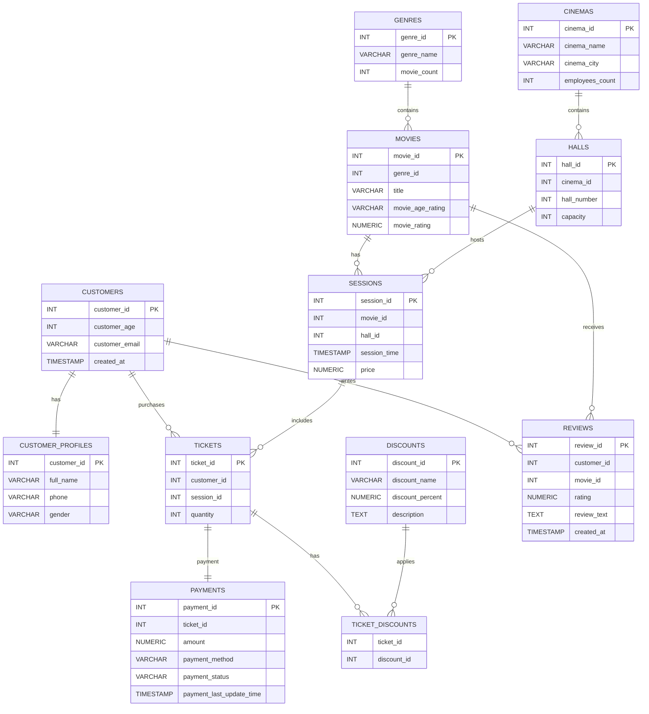

# 🎬 Cinema Network Database

A relational database for managing a cinema network, built with **PostgreSQL**. It covers the full operational flow: customers, movies, halls, sessions, ticket sales, payments, discounts and reviews, with role-based access for cashiers and managers.


## Overview

The project models how a real cinema chain operates: several cinemas, each with halls; movies grouped by genre; scheduled sessions; customers buying tickets (optionally with discounts) and paying for them; and leaving reviews afterwards.

The focus is on **solid database design** and **database-side logic**: constraints that protect data integrity, indexes backed by `EXPLAIN ANALYZE`, and business rules implemented through views, procedures and triggers.

## Highlights

- **12 normalized tables** with PK, FK, `UNIQUE` and `CHECK` constraints
- All three relationship types: **1:1, 1:N, M:N**
- **Realistic test dataset (~1.7M rows)** generated with a Python script (`psycopg2` + `Faker`), large enough to make query optimization measurable
- **Indexes** chosen and validated with `EXPLAIN ANALYZE`
- **View** exposing highly rated reviews (rating > 4)
- **Stored procedure** for updating session prices
- **Trigger + function** keeping `genres.movie_count` always in sync
- **Role-based access control**: cashier, local cinema manager, global manager

## Tech Stack

| Area | Tools |
|---|---|
| Database | PostgreSQL |
| Language | SQL, PL/pgSQL, Python 3 |
| Data generation | `psycopg2`, `Faker` |
| Diagrams | Mermaid |

## Data Model



### Tables

| Table | Purpose |
|---|---|
| `customers` | Core customer account data |
| `customer_profiles` | Extra personal details (split out for a clean 1:1 design) |
| `genres` | Movie genres with a denormalized `movie_count` |
| `movies` | Movie catalog |
| `cinemas` | Cinema locations |
| `halls` | Halls inside each cinema |
| `sessions` | Scheduled screenings (movie + hall + time + price) |
| `tickets` | Purchased tickets |
| `payments` | Payment records and statuses |
| `discounts` | Available discounts |
| `ticket_discounts` | Junction table for the tickets ↔ discounts M:N relation |
| `reviews` | Customer reviews of movies |

### Relationships

| Type | Relationships |
|---|---|
| **1:1** | `customers` ↔ `customer_profiles` |
| **1:N** | `genres` → `movies`, `cinemas` → `halls`, `movies` → `sessions`, `halls` → `sessions`, `customers` → `tickets`, `sessions` → `tickets`, `tickets` → `payments`, `customers` → `reviews`, `movies` → `reviews` |
| **M:N** | `tickets` ↔ `discounts` via `ticket_discounts` |

## Design Decisions

- **Profile split (1:1).** Authentication-level data lives in `customers`, personal details in `customer_profiles`. This keeps the main table lean and lets access to personal data be restricted separately.
- **Junction table for discounts.** A ticket can carry several discounts and a discount applies to many tickets, so `ticket_discounts` models it properly instead of storing lists in a column.
- **Denormalized `movie_count`.** Reading a genre's movie count is cheap, and a trigger keeps it consistent so the application never has to maintain it manually.
- **Constraints over application checks.** Ratings, prices, capacities and quantities are validated with `CHECK` constraints so invalid data is rejected at the database level regardless of the client.

## Database Logic

### View: top-rated reviews
Shows only reviews with a rating above 4, joined with movie and customer info, which is handy for a "what people love" feed.

```sql
SELECT * FROM <your_view_name>;
```

### Stored procedure: update session price
Centralizes price changes in one place instead of ad-hoc `UPDATE` statements.

```sql
CALL <your_procedure_name>(<session_id>, <new_price>);
```

### Trigger: automatic genre movie count
A trigger function fires on `INSERT`, `UPDATE` and `DELETE` on `movies` and adjusts `genres.movie_count`, so the counter is always accurate.

```sql
INSERT INTO movies (...) VALUES (...);
SELECT genre_name, movie_count FROM genres;  -- count updated automatically
```

## Test Data

Sample data is produced by `scripts/seed_data.py`, which uses `Faker` for realistic names, emails and text and bulk-inserts via `psycopg2.extras.execute_values`. Rows are generated in dependency order so every foreign key is valid.

| Table | Rows |
|---|---|
| `customers` / `customer_profiles` | 10,000 / 10,000 |
| `genres` | 5 |
| `movies` | 5,000 |
| `cinemas` / `halls` | 10 / 30 |
| `sessions` | 20,000 |
| `tickets` | 700,000 |
| `payments` | 700,000 (one per ticket) |
| `discounts` | 4 |
| `ticket_discounts` | ~280,000 (about 40% of tickets) |
| `reviews` | 5,000 |

The large `tickets` and `payments` tables are intentional: with hundreds of thousands of rows the difference between a sequential scan and an index scan becomes clearly visible.

## Performance: Indexes & `EXPLAIN ANALYZE`

Indexes were added for the most common access patterns (foreign keys and frequent filters) and verified by comparing query plans before and after.

| Query | Before | After | Plan change |
|---|---|---|---|
| `<describe query 1>` | `<x> ms` | `<y> ms` | Seq Scan → Index Scan |
| `<describe query 2>` | `<x> ms` | `<y> ms` | Seq Scan → Index Scan |

> Tip: paste a short before/after `EXPLAIN ANALYZE` snippet here. Concrete numbers make this section stand out.

## Security: Users & Roles

Access follows the principle of least privilege.

| Role | Intended user | Access |
|---|---|---|
| **Cashier** | Front-desk staff | Sell tickets, register payments, view sessions |
| **Local cinema manager** | Manager of one cinema | Manage sessions and halls, view reports for their cinema |
| **Global manager** | Network administration | Full access across all cinemas |

## Getting Started

**Prerequisites:** PostgreSQL 14+, `psql`, Python 3.9+.

```bash
# 1. Create the database
createdb cinema_network

# 2. Create schema, constraints and indexes
psql -d cinema_network -f sql/01_schema.sql

# 3. Create view, procedure and trigger
#    (before seeding, so movie_count is maintained during the load)
psql -d cinema_network -f sql/02_logic.sql

# 4. Install Python dependencies and configure the connection
pip install -r requirements.txt
cp .env.example .env        # then edit DB_HOST, DB_USER, DB_PASSWORD, DB_NAME

# 5. Generate test data (takes a minute or two)
python scripts/seed_data.py

# 6. Create roles and privileges
psql -d cinema_network -f sql/03_roles.sql
```

## Project Structure

```
.
├── sql/
│   ├── 01_schema.sql      # tables, constraints, indexes
│   ├── 02_logic.sql       # view, procedure, trigger
│   └── 03_roles.sql       # users and privileges
├── scripts/
│   └── seed_data.py       # test data generator
├── requirements.txt       # psycopg2-binary, Faker
├── .env.example           # connection settings template
├── .gitignore
└── README.md
```

## What I Practiced

- Designing a normalized schema and translating an ERD into DDL
- Modeling 1:1, 1:N and M:N relationships
- Enforcing data integrity with constraints
- Reading query plans and optimizing with indexes
- Writing PL/pgSQL functions, procedures and triggers
- Applying role-based access control in PostgreSQL

## Possible Improvements

- Prevent overselling by validating ticket `quantity` against hall `capacity` with a trigger
- Add a seat-level table for reserved seats
- Add reporting views (revenue per cinema, occupancy per session)
- Add automated tests for triggers and procedures
- Dockerize the setup for one-command startup

## Author

**<Your Name>** · [GitHub](https://github.com/<username>) · [LinkedIn](https://linkedin.com/in/<username>)