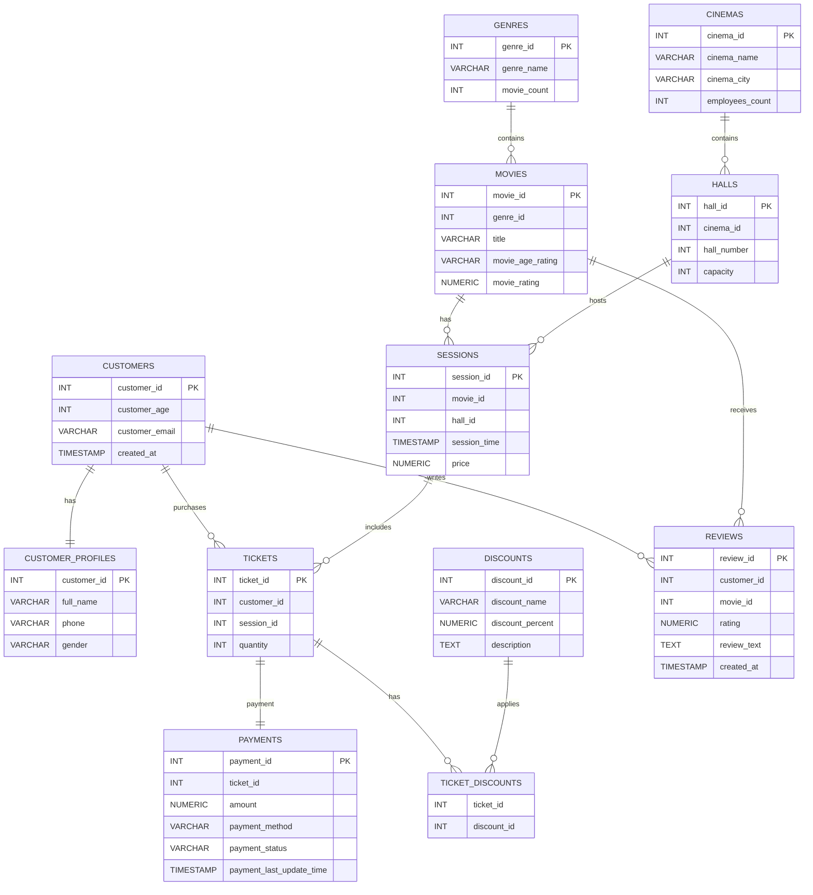

# 🎬 Cinema Network Database

A relational database for managing a cinema network, built with **PostgreSQL**. It covers the full operational flow: customers, movies, halls, sessions, ticket sales, payments, discounts and reviews, with role-based access for cashiers and managers.


## Overview

The project models how a real cinema chain operates: several cinemas, each with halls; movies grouped by genre; scheduled sessions; customers buying tickets (optionally with discounts) and paying for them; and leaving reviews afterwards.

The focus is on **solid database design** and **database-side logic**: constraints that protect data integrity, indexes backed by `EXPLAIN ANALYZE`, and business rules implemented through views, procedures and triggers.

## Highlights

- **12 normalized tables** with PK, FK, `UNIQUE` and `CHECK` constraints
- All three relationship types: **1:1, 1:N, M:N**
- **Realistic test dataset (~1.7M rows)** generated with a Python script (`psycopg2` + `Faker`), large enough to make query optimization measurable
- **Indexes** chosen and validated with `EXPLAIN ANALYZE`
- **View** exposing highly rated reviews (rating > 4)
- **Stored procedure** for updating session prices
- **Trigger + function** keeping `genres.movie_count` always in sync
- **Role-based access control**: cashier, local cinema manager, global manager

## Tech Stack

| Area | Tools |
|---|---|
| Database | PostgreSQL |
| Language | SQL, PL/pgSQL, Python 3 |
| Data generation | `psycopg2`, `Faker` |
| Diagrams | Mermaid |

## Data Model



### Tables

| Table | Purpose |
|---|---|
| `customers` | Core customer account data |
| `customer_profiles` | Extra personal details (split out for a clean 1:1 design) |
| `genres` | Movie genres with a denormalized `movie_count` |
| `movies` | Movie catalog |
| `cinemas` | Cinema locations |
| `halls` | Halls inside each cinema |
| `sessions` | Scheduled screenings (movie + hall + time + price) |
| `tickets` | Purchased tickets |
| `payments` | Payment records and statuses |
| `discounts` | Available discounts |
| `ticket_discounts` | Junction table for the tickets ↔ discounts M:N relation |
| `reviews` | Customer reviews of movies |

### Relationships

| Type | Relationships |
|---|---|
| **1:1** | `customers` ↔ `customer_profiles` |
| **1:N** | `genres` → `movies`, `cinemas` → `halls`, `movies` → `sessions`, `halls` → `sessions`, `customers` → `tickets`, `sessions` → `tickets`, `tickets` → `payments`, `customers` → `reviews`, `movies` → `reviews` |
| **M:N** | `tickets` ↔ `discounts` via `ticket_discounts` |

## Design Decisions

- **Profile split (1:1).** Authentication-level data lives in `customers`, personal details in `customer_profiles`. This keeps the main table lean and lets access to personal data be restricted separately.
- **Junction table for discounts.** A ticket can carry several discounts and a discount applies to many tickets, so `ticket_discounts` models it properly instead of storing lists in a column.
- **Denormalized `movie_count`.** Reading a genre's movie count is cheap, and a trigger keeps it consistent so the application never has to maintain it manually.
- **Constraints over application checks.** Ratings, prices, capacities and quantities are validated with `CHECK` constraints so invalid data is rejected at the database level regardless of the client.

## Database Logic

### View: top-rated reviews
Shows only reviews with a rating above 4, joined with movie and customer info, which is handy for a "what people love" feed.

```sql
SELECT * FROM <your_view_name>;
```

### Stored procedure: update session price
Centralizes price changes in one place instead of ad-hoc `UPDATE` statements.

```sql
CALL <your_procedure_name>(<session_id>, <new_price>);
```

### Trigger: automatic genre movie count
A trigger function fires on `INSERT`, `UPDATE` and `DELETE` on `movies` and adjusts `genres.movie_count`, so the counter is always accurate.

```sql
INSERT INTO movies (...) VALUES (...);
SELECT genre_name, movie_count FROM genres;  -- count updated automatically
```

## Test Data

Sample data is produced by `test_date_generation.py`, which uses `Faker` for realistic names, emails and text and bulk-inserts via `psycopg2.extras.execute_values`. Rows are generated in dependency order so every foreign key is valid.

| Table | Rows |
|---|---|
| `customers` / `customer_profiles` | 10,000 / 10,000 |
| `genres` | 5 |
| `movies` | 5,000 |
| `cinemas` / `halls` | 10 / 30 |
| `sessions` | 20,000 |
| `tickets` | 700,000 |
| `payments` | 700,000 (one per ticket) |
| `discounts` | 4 |
| `ticket_discounts` | ~280,000 (about 40% of tickets) |
| `reviews` | 5,000 |

The large `tickets` and `payments` tables are intentional: with hundreds of thousands of rows the difference between a sequential scan and an index scan becomes clearly visible.

## Performance: Indexes & `EXPLAIN ANALYZE`
Explanation

Before creating the index, PostgreSQL performed a Parallel Sequential Scan on the ticket_discounts table, meaning
it had to scan the entire table to find matching records.

After creating index (discount_id, ticket_id), PostgreSQL switched to Index Only Scan, allowing it to locate
the required rows directly through the index without reading the table itself.

The execution time decreased from 340.5 ms to 184.0 ms.
Indexes were added for the most common access patterns (foreign keys and frequent filters) and verified by comparing query plans before and after.

| Query | Before | After | Plan change |
|---|---|---|---|
| `<query 1>` | `340.539 ms` | ` 184.041` | Seq Scan → Index Scan |


This what i got when did this script 

    explain analyze
    select
    count(distinct t.customer_id) as cust_with_student_disc
    from tickets t
    join ticket_discounts td
        on t.ticket_id = td.ticket_id
    join discounts d
        on td.discount_id = d.discount_id 
        where d.discount_name = 'Student';


    CREATE INDEX idx_ticket_discounts_composite ON ticket_discounts(discount_id, ticket_id);
Result before index

    Aggregate  (cost=4815.06..4815.07 rows=1 width=8) (actual time=257.672..306.026 rows=1.00 loops=1)
    Buffers: shared hit=280520
    ->  Gather Merge  (cost=4694.05..4812.46 rows=1039 width=4) (actual time=238.774..299.803 rows=69817.00 loops=1)
        Workers Planned: 1
        Workers Launched: 1
        Buffers: shared hit=280520
        ->  Sort  (cost=3694.04..3695.57 rows=611 width=4) (actual time=174.079..176.244 rows=34908.50 loops=2)
              Sort Key: t.customer_id
              Sort Method: quicksort  Memory: 1537kB
              Buffers: shared hit=280520
              Worker 0:  Sort Method: quicksort  Memory: 769kB
              ->  Nested Loop  (cost=13.81..3665.76 rows=611 width=4) (actual time=0.180..163.712 rows=34908.50 loops=2)
                    Buffers: shared hit=280513
                    ->  Hash Join  (cost=13.39..3345.69 rows=611 width=4) (actual time=0.141..41.086 rows=34908.50 loops=2)
                          Hash Cond: (td.discount_id = d.discount_id)
                          Buffers: shared hit=1244
                          ->  Parallel Seq Scan on ticket_discounts td  (cost=0.00..2892.30 rows=165030 width=8) (actual time=0.018..12.341 rows=140275.50 loops=2)
                                Buffers: shared hit=1242
                          ->  Hash  (cost=13.38..13.38 rows=1 width=4) (actual time=0.107..0.108 rows=1.00 loops=2)
                                Buckets: 1024  Batches: 1  Memory Usage: 9kB
                                Buffers: shared hit=2
                                ->  Seq Scan on discounts d  (cost=0.00..13.38 rows=1 width=4) (actual time=0.098..0.100 rows=1.00 loops=2)
                                      Filter: ((discount_name)::text = 'Student'::text)
                                      Rows Removed by Filter: 3
                                      Buffers: shared hit=2
                    ->  Index Scan using tickets_pkey on tickets t  (cost=0.42..0.52 rows=1 width=8) (actual time=0.003..0.003 rows=1.00 loops=69817)
                          Index Cond: (ticket_id = td.ticket_id)
                          Index Searches: 69817
                          Buffers: shared hit=279269
    Planning:
     Buffers: shared hit=113 dirtied=1
    Planning Time: 1.567 ms
    Execution Time: 340.539 ms

Result after index

    Aggregate  (cost=3320.13..3320.14 rows=1 width=8) (actual time=183.653..183.654 rows=1.00 loops=1)
      Buffers: shared hit=279466
    ->  Sort  (cost=3314.94..3317.53 rows=1039 width=4) (actual time=178.042..180.174 rows=69817.00 loops=1)
        Sort Key: t.customer_id
        Sort Method: quicksort  Memory: 3073kB
        Buffers: shared hit=279466
        ->  Nested Loop  (cost=0.85..3262.88 rows=1039 width=4) (actual time=0.120..166.659 rows=69817.00 loops=1)
              Buffers: shared hit=279463
              ->  Nested Loop  (cost=0.42..2718.59 rows=1039 width=4) (actual time=0.109..16.487 rows=69817.00 loops=1)
                    Buffers: shared hit=195
                    ->  Seq Scan on discounts d  (cost=0.00..13.38 rows=1 width=4) (actual time=0.067..0.072 rows=1.00 loops=1)
                          Filter: ((discount_name)::text = 'Student'::text)
                          Rows Removed by Filter: 3
                          Buffers: shared hit=1
                    ->  Index Only Scan using idx_ticket_discounts_composite on ticket_discounts td  (cost=0.42..2003.84 rows=70138 width=8) (actual time=0.039..11.679 rows=69817.00 loops=1)
                          Index Cond: (discount_id = d.discount_id)
                          Heap Fetches: 0
                          Index Searches: 1
                          Buffers: shared hit=194
              ->  Index Scan using tickets_pkey on tickets t  (cost=0.42..0.52 rows=1 width=8) (actual time=0.002..0.002 rows=1.00 loops=69817)
                    Index Cond: (ticket_id = td.ticket_id)
                    Index Searches: 69817
                    Buffers: shared hit=279268
    Planning:
     Buffers: shared hit=153
    Planning Time: 1.716 ms
    Execution Time: 184.041 ms

## Security: Users & Roles

Access follows the principle of least privilege.

| Role | Intended user | Access |
|---|---|---|
| **Cashier** | Front-desk staff | Sell tickets, register payments, view sessions |
| **Local cinema manager** | Manager of one cinema | Manage sessions and halls, view reports for their cinema |
| **Global manager** | Network administration | Full access across all cinemas |


## Project Structure

```
.
├── sql/
│   ├── schema.sql      # tables
│   ├── features.sql       # view, procedure, trigger, index, users and privileges
│   
├── scripts/
│   └── test_date_generation.py       # test data generator
├── .gitignore
└── README.md
```

## What I Practiced

- Designing a normalized schema and translating an ERD into DDL
- Modeling 1:1, 1:N and M:N relationships
- Enforcing data integrity with constraints
- Reading query plans and optimizing with indexes
- Writing PL/pgSQL functions, procedures and triggers
- Applying role-based access control in PostgreSQL

## Possible Improvements

- Prevent overselling by validating ticket `quantity` against hall `capacity` with a trigger
- Add a seat-level table for reserved seats
- Add reporting views (revenue per cinema, occupancy per session)
- Add automated tests for triggers and procedures
- Dockerize the setup for one-command startup
